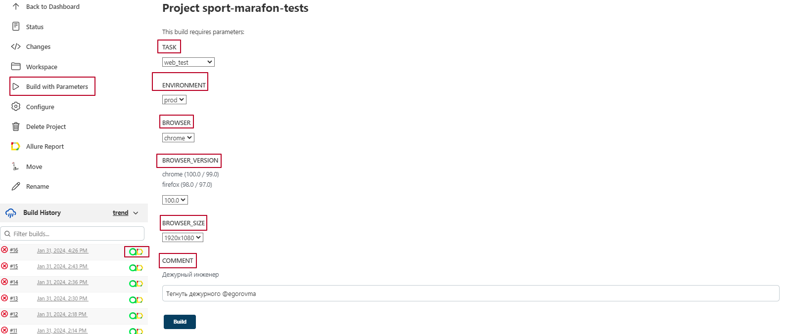
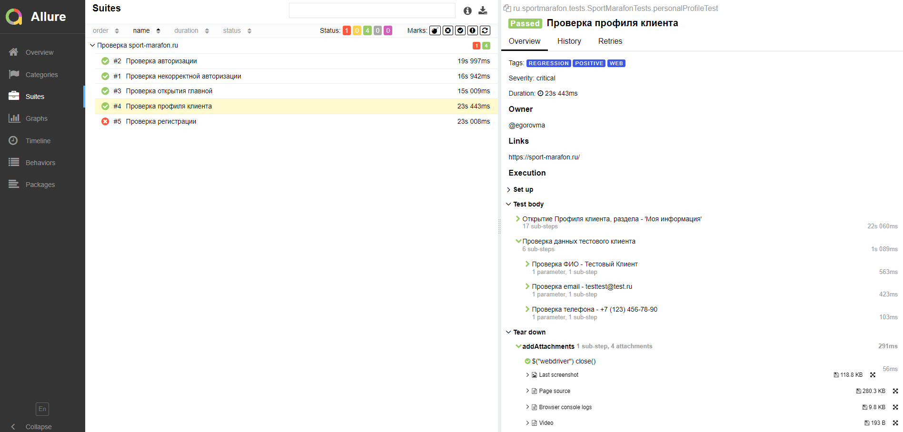
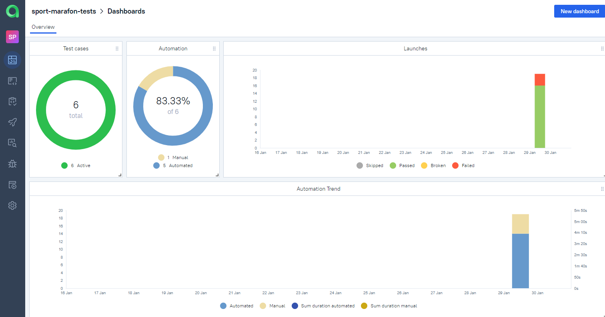
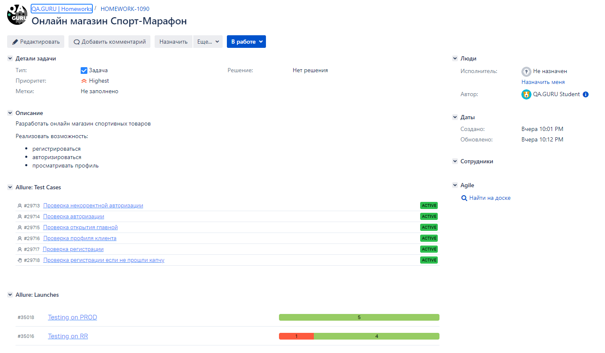
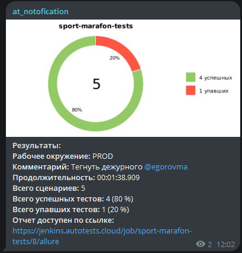

<h1 align="center">Проект по автоматизации тестирования онлайн магазина Спорт-Марафон</h1>

<p align="center">
<a href="https://sport-marafon.ru/"></a>
</p>

> Спорт-Марафон — один из крупнейших в России специализированных магазинов снаряжения для горнолыжного спорта и сноубординга, всех видов туризма, кемпинга и путешествий, альпинизма и скалолазания, бега и мультигонок.

##  Содержание:
- <a href="#cases"> Тест-кейсы</a>
- <a href="#autotests"> Запуск автотестов</a>
- <a href="#jenkins"> Сборка в Jenkins</a>
- <a href="#allureReport"> Пример Allure-отчета</a>
- <a href="#allure"> Интеграция с Allure TestOps</a>
- <a href="#jira"> Интеграция с Jira</a>
- <a href="#tg"> Уведомления в Telegram с использованием бота</a>
- <a href="#video"> Видео примера запуска тестов в Selenoid</a>

Тесты написаны на языке <code>Java</code> с использованием фреймворка для автоматизации тестирования <code>[Selenide](https://selenide.org/)</code>, сборщик - <code>Gradle</code>.

<code>JUnit 5</code> задействован в качестве фреймворка модульного тестирования.
При прогоне тестов для удаленного запуска используется <code>[Selenoid](https://aerokube.com/selenoid/)</code>.

Для удаленного запуска реализована джоба в <code>Jenkins</code> с формированием Allure-отчета и отправкой результатов в <code>Telegram</code> при помощи бота.
Также реализована интеграция с <code>Allure TestOps</code> и <code>Jira</code>.

Содержание Allure-отчета для каждого кейса:
* Шаги теста и результат их выполнения
* Скриншот страницы на последнем шаге (возможность визуально проанализировать, почему упал тест)
* Page Source (возможность открыть source страницы в новой вкладке и посмотреть причину падения теста)
* Логи консоли браузера
* Видео выполнения автотеста.

____
<a id="cases"></a>
## 🕵️‍♂️ Тест-кейсы
Auto:
- Проверка открытия главной 
- Проверка авторизации
- Проверка некорректной авторизации
- Проверка профиля клиента
- Проверка регистрации

Manual:
- Проверка регистрации если не прошли капчу

<a id="autotests"></a>
____
## ▶️ Запуск автотестов

### Запуск тестов из терминала

Для запуска тестов локально использовать команду ниже:
```
./gradlew clean test -Denv=local
```
Для запуска тестов на Selenoid использовать команду ниже:
```
./gradlew clean test -Denv=prod 
```

---
<a id="jenkins"></a>
##  </a> Сборка в <a target="_blank" href="https://jenkins.autotests.cloud/job/sport-marafon-tests/"> Jenkins </a>
Для доступа в Jenkins необходима регистрация на ресурсе [Jenkins](https://jenkins.autotests.cloud/)
Для запуска сборки необходимо перейти в раздел <code>Build with parameters</code>, выбрать необходимые параметры и нажать кнопку <code>Build</code>.
###  Параметры сборки в Jenkins:
- TASK (набор тестов для запуска)
- ENVIRONMENT (стенд для выполнения)
- BROWSER (браузер для запуска)
- BROWSER_VERSION (версия браузера)
- BROWSER_SIZE (размер окна браузера)
- COMMENT (тегнуть дежурного)
<p align="center">

</p>
После выполнения сборки, в блоке <code>Build History</code> напротив номера сборки появятся значки <code>Allure Report</code> и <code>Allure TestOps</code>, при клике на которые откроется страница с сформированным html-отчетом и тестовой документацией соответственно.

____
<a id="allureReport"></a>
##  </a> Пример <a target="_blank" href="https://jenkins.autotests.cloud/job/sport-marafon-tests/8/allure/"> Allure-отчета </a>
<p align="center">

</p>

---
<a id="allure"></a>
##  </a> Интеграция с <a target="_blank" href="https://allure.autotests.cloud/project/4009/dashboards"> Allure TestOps </a>
На *Dashboard* в <code>Allure TestOps</code> видна статистика количества тестов: сколько из них добавлены и проходятся вручную, сколько автоматизированы. Новые тесты, а так же результаты прогона приходят по интеграции при каждом запуске сборки.
<p align="center">

</p>

____
<a id="jira"></a>
##  </a> Интеграция с <a target="_blank" href="https://jira.autotests.cloud/browse/HOMEWORK-1090"> Jira </a>
Реализована интеграция <code>Allure TestOps</code> с <code>Jira</code>, в задаче отображается, какие тест-кейсы были написаны в рамках задачи и результат их прогона.
<p align="center">

</p>

____
<a id="tg"></a>
##  Уведомления в Telegram с использованием бота
После завершения сборки, бот, созданный в <code>Telegram</code>, автоматически обрабатывает и отправляет сообщение с отчетом о прогоне тестов в специально настроенный чат.
<p align="center">

</p>

____
<a id="video"></a>
##  Видео примера запуска тестов в Selenoid
В отчетах Allure для каждого теста прикреплен не только скриншот, но и видео прохождения теста
<p align="center">
  
</p>